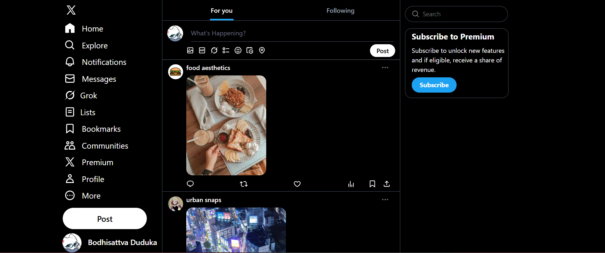

# X (Twitter) Clone – Tailwind CSS

A responsive front-end clone of **X (formerly Twitter)** built using **HTML and Tailwind CSS**.  
This project focuses on recreating the visual layout, spacing, and dark theme UI of X using utility-first CSS without any custom CSS frameworks.

## Live Preview
Open `index.html` locally after building Tailwind CSS.

## Features
- Dark mode UI inspired by X
- Responsive layout (sidebar, feed, and right panel)
- Sticky sidebar navigation
- Post composer UI
- Feed with image-based posts
- Clean utility-first styling using Tailwind CSS
- No external UI libraries

## Tech Stack
- HTML5
- Tailwind CSS
- PostCSS
- Google Fonts (Inter)

## Project Structure
```
X-clone-tailwind/
├── dist/
│   └── output.css
├── src/
│   └── input.css
├── index.html
├── tailwind.config.js
├── package.json
└── README.md
```

## Setup Instructions

### 1. Clone the Repository
```bash
git clone https://github.com/Bodhisattva-Duduka/X-clone-tailwind.git
cd X-clone-tailwind
```

### 2. Install Dependencies
```bash
npm install
```

### 3. Build Tailwind CSS
```bash
npm run dev
```

This command watches for changes and generates `dist/output.css`.

### 4. Run the Project
Open `index.html` in your browser.

## Tailwind Configuration
Tailwind is configured to scan `index.html` for class usage to generate optimized CSS.

```js
content: ["./index.html"]
```

## What I Learned
- Building complex layouts using Tailwind utilities
- Responsive design using custom breakpoints
- Structuring large HTML files cleanly
- Debugging Tailwind content and build issues
- Utility-first CSS workflow

## Screenshots


## License
This project is for learning and practice purposes only.
